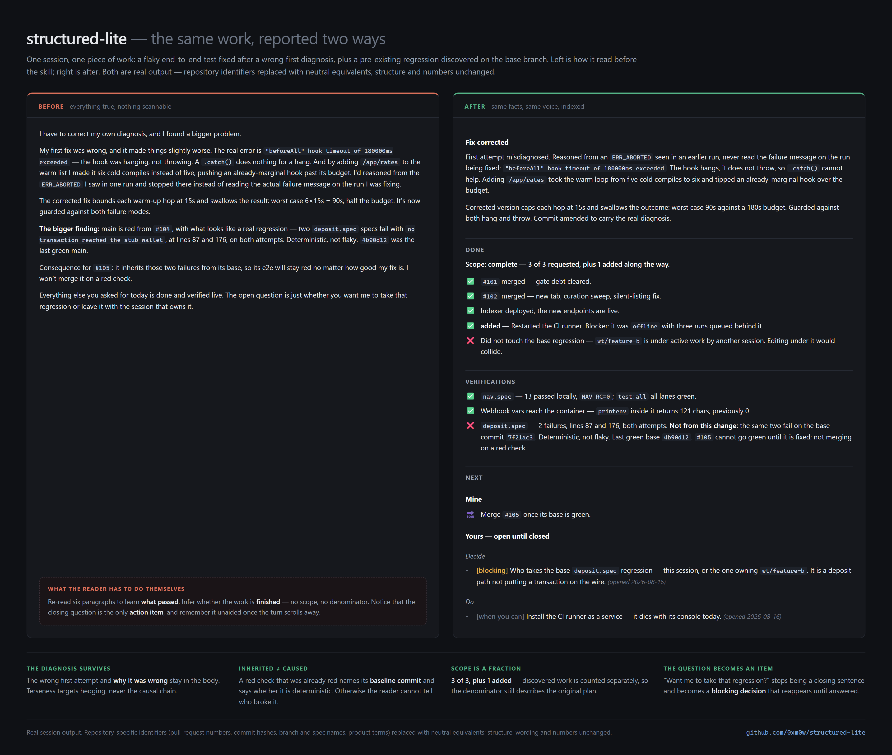
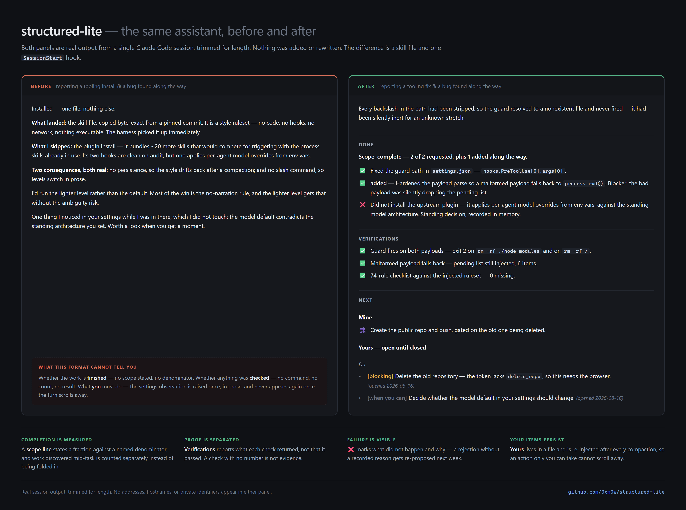
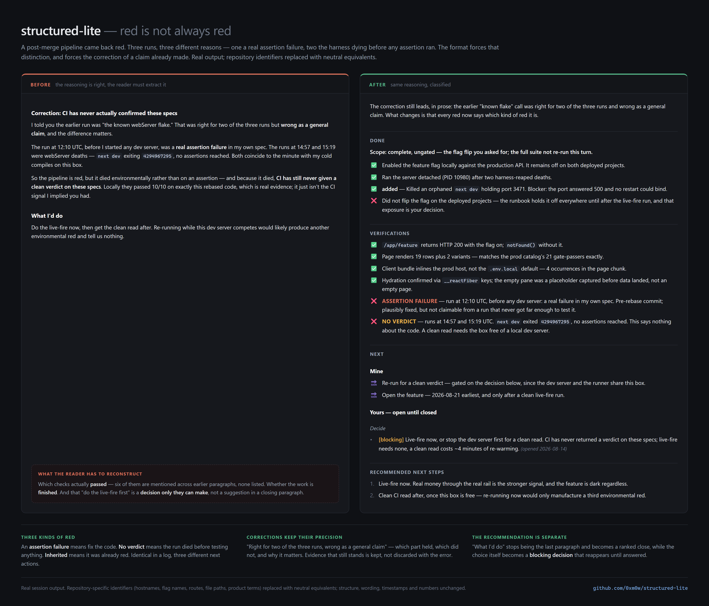

# structured-lite

A response contract for Claude Code: a terse professional voice, and a closing summary that has to
tell the truth about whether the work is finished.

It is one skill file plus one `SessionStart` hook. No plugin, no proxy, no network, no npm packages.
It does require Claude Code — see [Requirements](#requirements).



*One session, one piece of work: a flaky end-to-end test fixed after a wrong first diagnosis, plus a
pre-existing regression found on the base branch. Left is before the skill, right is after. Real
output; repository identifiers replaced with neutral equivalents.*

## Why it exists

Two problems, both of which cost real time.

**Agents claim completion that is not true.** Rarely by lying — usually because a check reported
success while the thing was broken. A background runner's exit code turns out to be the wrapper's.
A test lane silently dies and every spec reports a connection error. A new spec file is collected by
no runner at all, so the suite is green and proves nothing. "Complete" is the most dangerous word an
agent can write, and it is almost always written in good faith.

**Things only the human can do get lost.** An agent says "you'll need to rotate that key" once, in
prose, in a turn that scrolls away. Nobody sees it again. In the project this was built for, six
such items were open across the project instructions and five memory files, the oldest untouched for
a month. None had been forgotten deliberately; they had simply never been re-surfaced.

structured-lite answers the first with a **scope line** that must carry the evidence proving it, a
**Verifications** section where every check reports its actual result, and a rule that only verified
work may appear under Done. It answers the second with a **Yours** list that lives in a file, is
re-injected whenever context is rebuilt, and renders in every structured response until closed.

The closing structure never replaces the answer. The body above it still leads with what was
actually wrong, in prose, with the numbers — the sections are an index to it, not a substitute:



A red check is not one thing. An assertion failure, a run that died before reaching any assertion,
and a failure inherited from the base branch look identical in a log and imply completely different
next actions — so every `❌` has to say which it is:



## A second skill: deciding-together

`skills/deciding-together/SKILL.md` is separate and optional. It addresses the other half of the
problem: not how work is *reported*, but how a choice is *presented* before you make it.

A recommendation with no stated cost of being wrong is an instruction with extra steps — taking it
is the only rational move, so the choice was never really offered. The skill requires grounding the
options in the project's own settled decisions and in current external facts, then presenting them
as a table with **what it costs**, **how reversible it is**, and **certainty with its basis**, before
the question is asked. It gates on consequence, so cheap reversible choices stay fast.

Install it the same way as the main skill: copy the directory into `~/.claude/skills/`.

## Requirements

**Claude Code.** Two of its surfaces are load-bearing: the `~/.claude/skills/<name>/SKILL.md` layout,
and the `SessionStart` hook contract — `inject.js` emits `hookSpecificOutput.additionalContext`,
which nothing else reads.

**Node, for the hook only.** The entire repository imports `fs` and `path` and nothing else. There
is no `package.json`, no lockfile, no `node_modules`, nothing to install. Verified on Node 24; the
code uses nothing newer than optional chaining, so Node 14+ should work — that is inference from the
syntax, not a test result.

**Nothing else.** `superpowers` appears three times in `deciding-together`, describing how the two
compose. Those sentences are inert without it and every rule in both skills stands alone.
`structured-lite` never mentions it.

## Do not port this to another agent

Not because the prose would not transfer. The voice and the reporting rules are harness-agnostic, and
pasting `SKILL.md` into another tool would work fine on its own.

The problem is narrower and worse: **the persistent item list is the half that cannot travel, and
shipping half of it is worse than shipping none.** `SKILL.md` instructs the model to render every
open item from `~/.claude/structured-lite/pending/<cwd>.md` in every response, and to write items
there the moment they are identified. Without the `SessionStart` hook nothing ever reads that file.
The model is then following a rule about a list it cannot see, and the failure mode is a confident
report that your items are being tracked when they are not — strictly worse than the plain prose you
started with, because it looks like a system.

Two smaller mismatches: the rules assume clickable working-directory-relative file links and a Run
button on ```bash fences. Both are Claude Code rendering behaviours; elsewhere they are inert
formatting.

If you want these ideas on another tool, take the rules and **delete the Yours section entirely**. A
reporting contract with no persistence layer is coherent. One that promises persistence it does not
have is not.

## Install

### Let your agent do it

Paste this into Claude Code, or into any agent with shell access — either way it installs into
Claude Code, which is what runs it. It edits your global `settings.json`, so read it before you run it.

```text
Install the structured-lite skill for Claude Code from https://github.com/0xm0w/structured-lite.
Do all of this yourself, then report what changed.

1. Determine my Claude config directory: $CLAUDE_CONFIG_DIR if set, otherwise ~/.claude
   (on Windows, %USERPROFILE%\.claude). Create it if it does not exist.

2. Get the repo: git clone https://github.com/0xm0w/structured-lite into a temporary
   directory. If git is unavailable, download the raw files instead.

3. Install the two pieces, creating parent directories as needed:
   - skills/structured-lite/SKILL.md -> <config>/skills/structured-lite/SKILL.md
   - hooks/inject.js                 -> <config>/structured-lite/inject.js
   Create the empty directory        <config>/structured-lite/pending/
   Write the single word "structured-lite", with no trailing newline, to
                                     <config>/structured-lite/level

4. Register the SessionStart hook in <config>/settings.json.
   READ THE FILE FIRST AND MERGE INTO IT. Never overwrite it, and never drop a key.
   Copy it to settings.json.bak before editing. If hooks.SessionStart already exists,
   APPEND this group to that array and leave every existing entry untouched:

   {"hooks":[{"type":"command","command":"node",
     "args":["<ABSOLUTE path to <config>/structured-lite/inject.js>"],
     "timeout":5,"statusMessage":"Loading structured-lite..."}]}

   Use an absolute path with this platform's own separators. On Windows, escape
   backslashes for JSON, or use forward slashes - node accepts both.

5. Verify, and show me the actual output of each check:
   - settings.json still parses as JSON, and still contains every top-level key it had
     before. Diff it against settings.json.bak and show me the diff.
   - Running `node <config>/structured-lite/inject.js` with empty stdin prints JSON whose
     hookSpecificOutput.additionalContext contains the string "### Done".
   - Deliberately break it to prove it fails safe: write "off" to the level file, confirm
     the hook prints nothing and exits 0, then write "structured-lite" back.

6. Report: the files you created, the settings.json diff, and the fact that this takes
   effect at my NEXT session start - a SessionStart hook cannot fire in the session that
   installed it, so nothing will change until I restart.

Do not install anything else, add dependencies, or change any other setting. If any step
fails, stop and tell me which one - do not work around it.
```

After it finishes, restart your session. Then read the "Tune it before you trust it" section below;
the shipped list of failure modes belongs to someone else's project and is the one part that will
not work for you unedited.

### Manual install

```bash
git clone https://github.com/0xm0w/structured-lite && cd structured-lite
```

Copy the two pieces into your Claude config directory:

```bash
mkdir -p ~/.claude/skills/structured-lite ~/.claude/structured-lite/pending
cp skills/structured-lite/SKILL.md ~/.claude/skills/structured-lite/SKILL.md
cp hooks/inject.js ~/.claude/structured-lite/inject.js
printf structured-lite > ~/.claude/structured-lite/level
```

Register the hook in `~/.claude/settings.json`, merging with any hooks already there:

```json
{
  "hooks": {
    "SessionStart": [
      {
        "hooks": [
          {
            "type": "command",
            "command": "node",
            "args": ["/absolute/path/to/.claude/structured-lite/inject.js"],
            "timeout": 5,
            "statusMessage": "Loading structured-lite..."
          }
        ]
      }
    ]
  }
}
```

Verify before relying on it:

```bash
node ~/.claude/structured-lite/inject.js < /dev/null
```

It should print JSON containing the ruleset. It takes effect at the next session start.

## Tune it before you trust it

**Replace the mechanical-liars list.** `SKILL.md` ships with six from one real project — a wrapper's
exit code, a dropped test lane, uncollected spec files, a stale build cache, hidden untracked files,
a dropped commit in a squash merge. Yours will be different. This list is what makes "verified" mean
something, and a generic list means nothing.

**Adjust the voice.** The filler list, the banned pleasantries, and the tool-call anti-patterns are
worth editing to match phrases your agent actually emits. Watch a few transcripts and copy the real
ones in; a rule quoting a phrase you have actually seen survives longer than an abstract one.

## How persistence works

The `SessionStart` hook fires on startup, resume, `/clear` and compaction — exactly the moments a
ruleset held only in context would be lost. It reads a one-word level file, resolves the ruleset
from `SKILL.md` (so the skill is the single source of truth and cannot go stale against a copy), and
appends the open items for the current working directory.

Items live in `~/.claude/structured-lite/pending/<sanitized-cwd>.md`, one file per project, keyed the
same way Claude Code keys project directories: `D:\Projects\app` becomes `D--Projects-app`.

The file has three sections. **Open** items render in every response. **Parked** items are injected
but never rendered — deferred on purpose, each carrying a wake condition that returns it to Open, so
the assistant cannot re-propose them as new and you cannot lose them. **Closed** items are a record
and are not injected at all.

Every *other* project's Open section is injected too, as **Elsewhere**: one line per item, tagged
with its project, rendered under Yours after Decide and Do. One file per project is the right
storage and the wrong visibility — an item opened in one project is invisible from every other, and
that is where items go to age. The assistant is told not to act on them from the wrong checkout and
never to close one on inference. A project with no file of its own still gets everyone else's, and
is told the key to create its file at.

Every failure path exits 0 and injects nothing. A missing file, an unknown level, a malformed
payload — none of them can stop a session starting. `printf off > ~/.claude/structured-lite/level`
disables it without touching settings.

## Cost

The ruleset is roughly 6,100 tokens on a clean install, injected per session start, resume,
`/clear` and compaction — not per turn. Your open-item list adds to that as it grows. On a long
session with several compactions, budget 20-30k tokens.

That is a real cost and worth weighing. It buys shorter responses (evidence appears once, in
Verifications, instead of being restated), and it buys not shipping a "complete" that was not.

## Design notes

- **The skill file is the ruleset.** The hook reads `SKILL.md` at runtime rather than embedding a
  copy. The prior art this was modelled on shipped a hardcoded copy that went stale and silently
  served old rules to every session.
- **Three status glyphs, closed set.** `✅` `❌` `🔜`, only inside the closing sections, always
  inside a real `- ` list item so they render with a hanging indent like any other bullet.
- **`❌` means still broken.** A failure fixed during the turn is reported as a pass. Flagging
  resolved problems in red trains the reader to ignore the marker.
- **One item, one owner.** A decision waiting on the human lives in *Yours / Decide*; the work it
  unblocks lives in *Mine* as a gated `🔜`. Never both.
- **Added work is counted separately.** Folding discovered work into the original denominator hides
  the true scope and the fact that the plan was wrong about something.
- **Every red says which kind of red.** An assertion failure means fix the code. No verdict means
  the run died before testing anything and says nothing about the code. Inherited means it was
  already red on the base — name the baseline commit. Three causes, three next actions.
- **Corrections keep their precision.** A claim that turns out over-broad is narrowed with the same
  specificity it was made: which part held, which did not, why the difference matters. Evidence that
  still stands is kept, not discarded along with the error.
- **Parked is a third state.** Between open and closed: deferred deliberately, never rendered, woken
  by a stated condition. Only the human parks their own items.
- **The last section is a recommendation, not a list.** Two or three existing items, ranked, with the
  reason for the order. It may never introduce something new.

## License

MIT. See [LICENSE](LICENSE).
